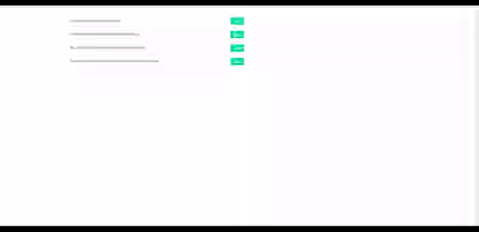

# How to build a reusable Modal Overlay/Dialog Using Angular CDK

You can find the demo for this repo [here](https://mainawycliffe.github.io/ng-cdk-overlay-demo/) and the accompanying article
[here](https://codinglatte.com/posts/angular/reusable-modal-overlay-using-angular-cdk-overlay/).
